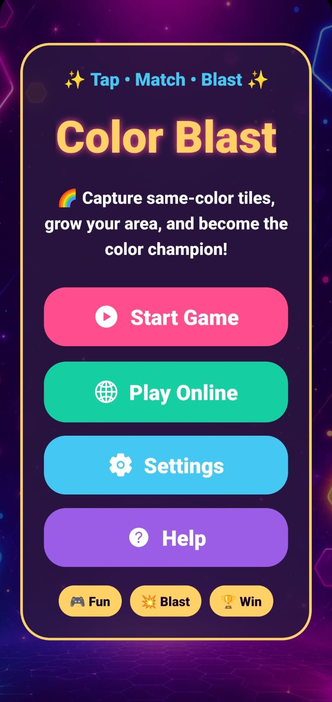
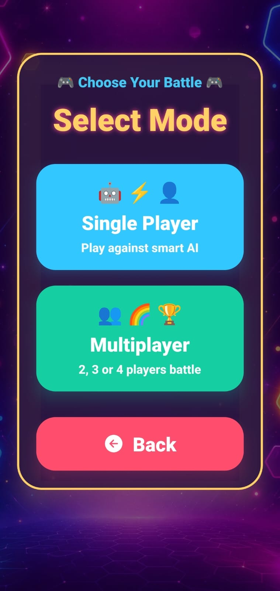
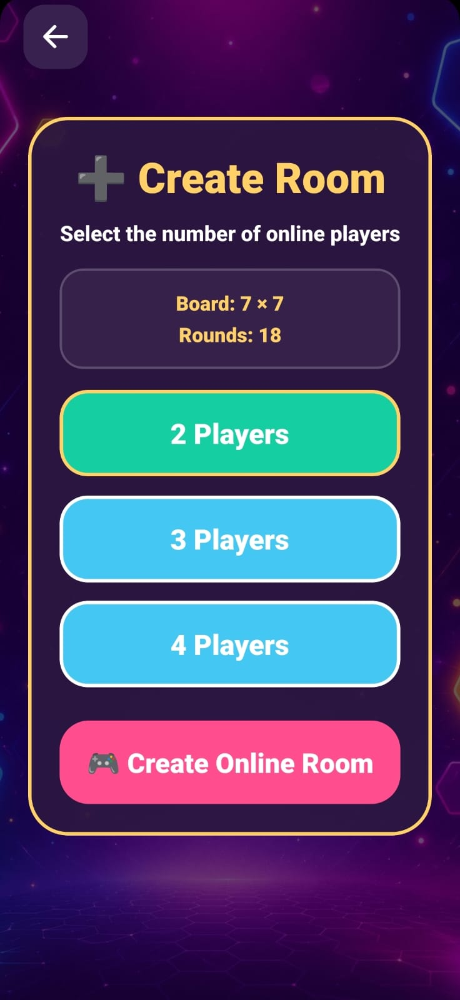
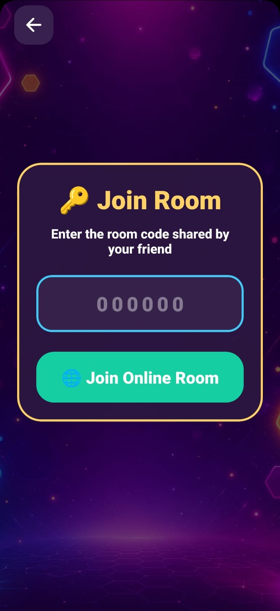
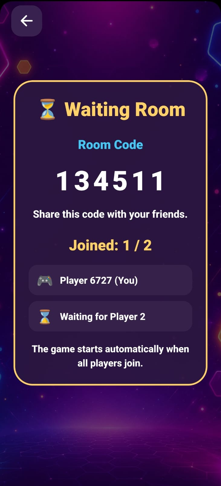
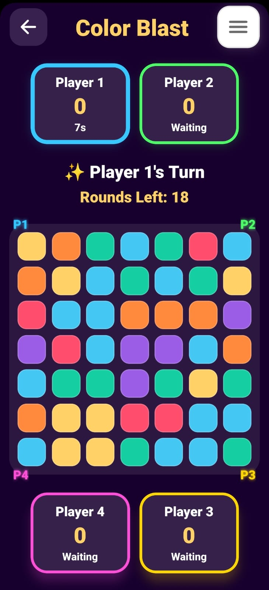
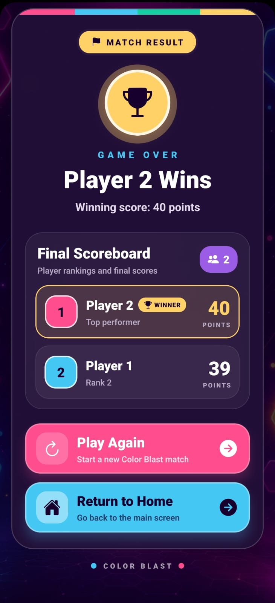
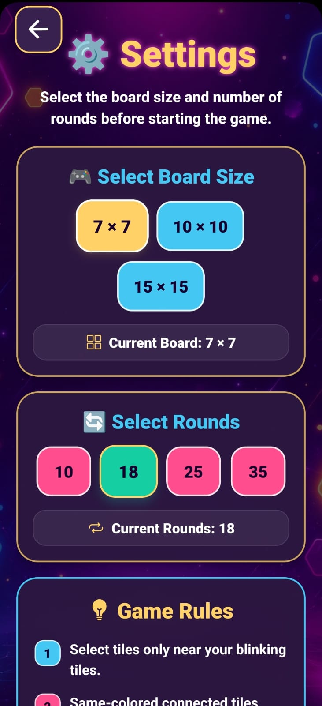

# 🎮 Color Blast

A real-time multiplayer strategy game built with **React Native** and **Firebase Realtime Database**, where players compete to capture the board by strategically coloring tiles. The game supports both offline and online gameplay with live synchronization, multiple game modes, and customizable board sizes.

---

# ✨ Features

### 🎮 Game Modes
- Single Player (vs AI)
- Offline Multiplayer (2–4 Players)
- Online Multiplayer using Room Codes

### 🌐 Online Multiplayer
- Create a game room
- Join using a unique room code
- Real-time gameplay synchronization
- Automatic game start after all players join
- Live turn updates

### 🎲 Gameplay
- Multiple board sizes (7×7, 10×10, 15×15)
- Customizable number of rounds
- Turn timer
- Intelligent AI opponent
- Real-time score tracking
- Winner announcement and draw detection

### 🎨 User Interface
- Modern and responsive UI
- Animated home screen
- Interactive waiting room
- Smooth screen navigation

---

# 🛠 Tech Stack

| Technology | Purpose |
|------------|---------|
| React Native | Cross-platform Mobile Application Development |
| JavaScript | Programming Language |
| Firebase Realtime Database | Real-time Multiplayer Synchronization |
| AsyncStorage | Local Data Storage |
| React Navigation | Screen Navigation |
| Expo | Development & Build Platform |
| Git | Version Control |
| GitHub | Source Code Management |

---

# 📂 Project Structure

```
ColorBlast
│
├── assets/
│   ├── images/
│   ├── icons/
│   └── screenshots/
│
├── components/
│
├── screens/
│   ├── Home
│   ├── OfflineGame
│   ├── OnlineGame
│   ├── CreateRoom
│   ├── JoinRoom
│   ├── WaitingRoom
│   └── Settings
│
├── firebase/
│
├── utils/
│
├── App.js
└── package.json
```

---

# 🚀 Installation

## Clone the Repository

```bash
git clone https://github.com/yourusername/ColorBlast.git
```

## Navigate to the Project

```bash
cd ColorBlast
```

## Install Dependencies

```bash
npm install
```

## Run the Application

```bash
npx expo start
```

Scan the QR code using the **Expo Go** app or run the project on an Android Emulator.

---

# 🎮 How to Play

## Offline Mode

1. Select **Offline Mode**.
2. Choose the number of players.
3. Select the board size.
4. Start the game.
5. Capture tiles to score points.
6. The player with the highest score wins.

---

## Online Multiplayer

1. Create a game room.
2. Share the room code with friends.
3. Other players join using the room code.
4. The game starts automatically after all players join.
5. Compete in real time until the match ends.

---

# 📷 Screenshots

| Home | Mode Selection |
|------|----------------|
|  |  |

| Create Room | Join Room |
|-------------|-----------|
|  |  |

| Waiting Room | Gameplay |
|--------------|----------|
|  |  |

| Winner | Settings |
|---------|----------|
|  |  |

---

# 🚀 Future Enhancements

- Player Profiles
- Match History
- Global Leaderboard
- Friends System
- In-game Chat
- Tournament Mode
- Achievement Badges
- Custom Themes

---

# 📚 Learning Outcomes

This project helped in gaining practical experience with:

- Cross-platform mobile application development using React Native.
- Building real-time multiplayer applications with Firebase Realtime Database.
- Designing turn-based game logic and synchronization.
- Managing application state and asynchronous operations.
- Implementing responsive and interactive user interfaces.
- Working with local storage using AsyncStorage.
- Structuring scalable React Native projects.
- Version control and collaborative development using Git and GitHub.
- Deploying and testing mobile applications using Expo.
- Debugging, optimizing, and improving application performance.